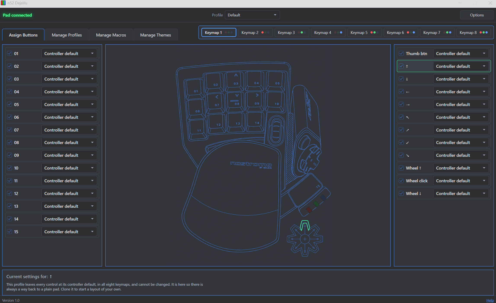

---
<p align=center>The **Belkin Nostromo SpeedPad n52** (F8GFPC100)</p>

Ok, so let's take stock of the situation. I have about 5 years of experience with basic programming. I know hardware troubleshooting extensively and I have the Speedpad, which still works. I have a default driver in Windows that recognizes the device. I do *not* have software that (reliably) works so I can remap keys on it.

So, I went about querying Claude about how I could get the device to work with modern Windows. What I'm presenting here is the end result after weeks of research, trial and error and polishing.

This now offers more than the original software did.

This software has eight keymaps per profile, macros, per-application switching, and the pad's three state lamps driven the way the hardware intended. It reads the pad directly over
Microsoft's `winusb.sys`, and adds no kernel driver foolery - all I did was write up an inf for the device to be recognized properly, have it named correctly in Device Manager, and write up this software:



<sub>Every input the pad has, all available for assignment via dropdown menus. Pressing a key will highlight it in the artwork and also highlight the associated row/dropdown for quick finding *(The same thing as clicking a key in the artwork)*. The eight keymaps run across the top, each showing the lamp pattern the hardware displays while it is live. The example screenshot shown is the locked <b>Default</b> profile, with nothing yet assigned.</sub>

---

## Contents

* [The short version](#the-short-version)
* [Setting it up](#setting-it-up)
* [What you can assign](#what-you-can-assign)
* [How it reaches the pad](#how-it-reaches-the-pad)
* [What the pad sends](#what-the-pad-sends)
* [Building it yourself](#building-it-yourself)
* [What is in here](#what-is-in-here)
* [License and credit](#license-and-credit)

---

## The short version

The n52 remembers nothing. It has no onboard storage, so every layout it ever had lived in a configuration on the PC, and the pad itself does one fixed thing forever: keys 01 to 15 type Tab, Q, W, E, R and so on, and the thumb pad types the arrow keys.

Since Belkin and Razer do not support the product any longer, I needed to find a replacement or come up with my own.

So...here we are - my little pet project I titled **n52 DejaVu.**


---

## Setting it up

To run the software, you'll need the pad, and either 64-bit Windows 10 (v.1607 or later) or Windows 11.

Run `n52dejavu-1.0-setup.exe`. It fetches the [.NET 10 Desktop Runtime](https://dotnet.microsoft.com/download/dotnet/10.0) if your machine does not already have it, then installs the software and transfers control of the pad's two USB interfaces to `winusb.sys` - which is what lets us read the device for keymapping.

There is also `n52dejavu-1.0.msi` for deployment - same software, no runtime handling, and the pad hand-over is an optional feature. The help guide has the details.

Uninstalling transfers control of the pad back to Windows as an hid device. There is also **Undo pad setup** in the Start Menu if you want the hardware back without removing the software.

<details>
<summary>Doing it by hand instead</summary>

Put the build output wherever you like, then run `driver\install.ps1` from an elevated PowerShell;
`uninstall.ps1` reverses it. Step by step in the guide under *Installing manually*.

</details>

`docs/help.md` is the full guide - every assignment type, the keymap system, profiles, macros, themes and troubleshooting.

Settings live in `%LOCALAPPDATA%\n52-dejavu\config.json` as readable JSON. Deleting it is a
safe reset.

> **Worth knowing before you commit to it:** Once the interfaces are rebound, Windows no
> longer sees the device as a keyboard or mouse. The pad does nothing unless n52 DejaVu is running -
> including at the sign-in screen, so you cannot type your password with it. That is the
> price of being able to remap it properly, and `uninstall.ps1` undoes it in seconds.


---

## What you can assign

Any control can send a key, with any combination of Ctrl, Shift, Alt and Win held
alongside. Beyond that:

**Macros.** A named sequence of key presses, typed text, mouse clicks and waits, built once
and usable from as many controls as you like. Repeat is chosen per control rather than per
macro, so the same sequence can fire once on one key and loop on another.

**Text and programs.** Type a string, or launch an application, document or URL.

**Mouse.** All five buttons, plus wheel notches in either direction.

**Eight keymaps per profile.** Every control can do eight different things, switched from
the pad itself, with the pad's own lamps showing which one is active. Keymaps can be stepped
through, jumped to, or held down like a shift key.

**Profiles that follow the foreground application**, so the pad config changes automatically
as you move between programs, or "stays put" if you would rather it didn't.

Keys are sent as scancodes rather than virtual keys, so games reading input through
DirectInput or Raw Input see them as real keystrokes. **F13 to F24 keys** are offered too: they
exist on no physical keyboard, so nothing else on the machine is competing for them.


---

## How it reaches the pad

The pad puts up two USB interfaces. `MI_00` carries the keys, the thumb pad, the wide bar
and the round button; `MI_01` carries the scroll wheel and the three state lamps. Out of the
box Windows treats the first as a keyboard and the second as a mouse - which is why a
remapper that only watches the keyboard misses half the device.

Both are bound to `winusb.sys`, Microsoft's own in-box driver, and read directly. Nothing of
ours runs in the kernel. Setup is a one-page INF, a signature to install and recognize it,
and this software - all are removable via uninstall.

The one thing that does need saying plainly: because the interfaces belong to WinUSB, every
keystroke you send from the pad is one this application is sending. Even leaving a control
alone means reading its signal and sending the same thing back out. The software can probably
be looked at best as an "enhancer" and translator.


---

## What the pad sends

Below is the unconfigured, straight from the hardware "Controller default".
All of it was measured on a physical unit with `tools/DejaVu.RawProbe`, which
checks the pad against the model in `src/DejaVu.Core/Model/PadLayout.cs` and
tells you where they disagree.

| Control | Types by default | Scancode |
|----|----|----|
| 01 | Tab | `0x0F` |
| 02 | Q | `0x10` |
| 03 | W | `0x11` |
| 04 | E | `0x12` |
| 05 | R | `0x13` |
| 06 | Caps Lock | `0x3A` |
| 07 | A | `0x1E` |
| 08 | S | `0x1F` |
| 09 | D | `0x20` |
| 10 | F | `0x21` |
| 11 | Left Shift | `0x2A` |
| 12 | Z | `0x2C` |
| 13 | X | `0x2D` |
| 14 | C | `0x2E` |
| 15 - the wide bar | Space | `0x39` |
| Round thumb button | Left Alt | `0x38` |
| Thumb pad, four ways | Arrow keys | `E0 48` · `E0 50` · `E0 4B` · `E0 4D` |
| Wheel click | Middle mouse button | on `MI_01` |
| Wheel, either way | Mouse wheel, ±120 | on `MI_01` |

**23 inputs that report**, and four more you can still assign: the pad's corners. There is
no switch behind a diagonal - the pad closes the two arrows either side of it - so the
software composes them. Assigning a corner claims both of its arrows, because the two
switches close as much as a third of a second apart and the alternative leaks a stray arrow
key on every roll into it.

---

## Building it yourself

The .NET 10 SDK, and:

```
dotnet build -c Release
```

The application appears in `src/DejaVu.App/bin/Release/net10.0-windows/`. Nothing else is
needed - no NuGet packages, no SDK beyond the framework itself.

For the installer, additionally [WiX](https://wixtoolset.org/) - version 5, which is the
last MIT-licensed release; 6 and later require accepting the Open Source Maintenance Fee:

```
dotnet tool install --global wix --version 5.*
wix extension add -g WixToolset.Util.wixext/5.0.2
wix extension add -g WixToolset.UI.wixext/5.0.2
wix extension add -g WixToolset.BootstrapperApplications.wixext/5.0.2
```

then:

```
.\installer\build.ps1
```

which publishes the application and packages it into `dist/`.


---

## What is in here

| Path |    |
|----|----|
| `src/DejaVu.Core` | Reading the pad over WinUSB, and everything an assignment can do |
| `src/DejaVu.App` | The editor, and the notification-area icon that outlives it |
| `driver` | The INF, and the scripts that bind and unbind `winusb.sys` |
| `docs/help.md` | The user guide |
| `tools/DejaVu.RawProbe` | Checks a physical pad against the layout model |
| `tools/DejaVu.TypeProbe` | Measures how fast text can be injected before it corrupts |
| `tools/theme-gen` | Regenerates the built-in color themes |
| `installer` | WiX authoring for the .msi and the bootstrapper, and the script that builds both |

The two probes are instruments, not part of the application. They exist because both of the
awkward measurements in this project - what the pad emits, and how fast Windows will accept
injected text - needed answering with a device rather than guesswork, and will need answering
again on someone else's hardware possibly.


---

## License and credit

**[PolyForm Noncommercial 1.0.0](https://polyformproject.org/licenses/noncommercial/1.0.0),
plus a source-availability condition.** See `LICENSE` for the terms that actually
bind; this is only a summary of them.

Yours to use, change, fork and share for anything that is not commercial - personal use,
hobby projects, research, schools, charities. Two things it does not allow: selling it, or
bundling it with something you sell, including a refurbished pad. And if you hand someone a
build, hand them the source that made it.

This is source-available rather than open source: the non-commercial restriction is not an
OSI-approved term, and it is a deliberate choice rather than an oversight. The pad was
abandoned by the company that sold it; the software that brings it back should not become
someone else's product.

This software is unofficial and in no way affiliated with Belkin or Razer.

Written for one abandoned keypad, by someone who still uses it.