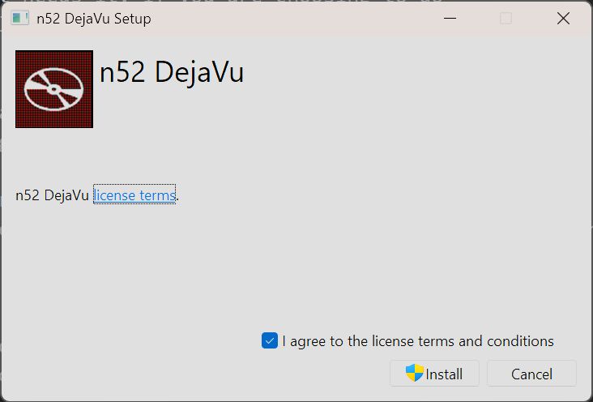
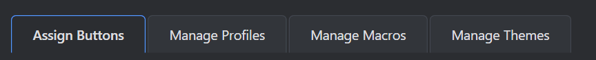
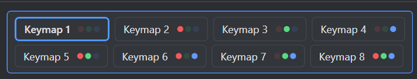
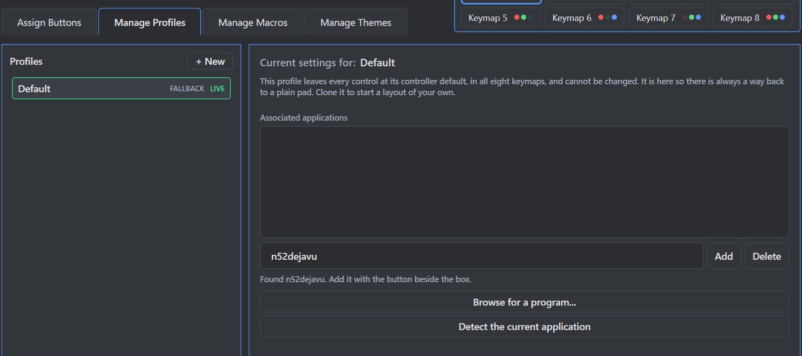
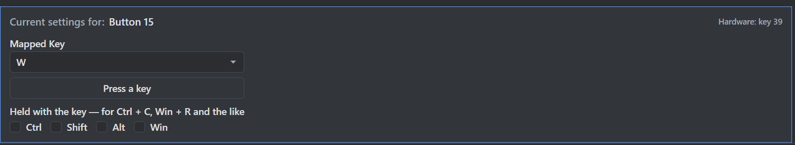
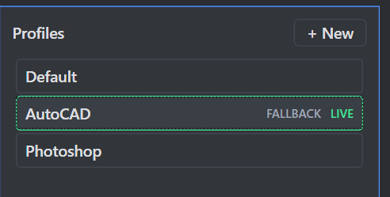
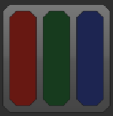

# n52 DejaVu - User Guide

n52 DejaVu replaces the original **Belkin Nostromo Profile Editor**, which is no longer
maintained - its last release was version 3.2.4, in 2007 - supported only three keymap layouts, and
needs a handful of workarounds to run at all on a modern version of Windows. This software returns full
functionality with a modern interface, uses Windows' own built-in USB driver, and adds to what the
original could do: every key (01-15), the thumb pad, the thumb button and the wheel can be bound to
send whatever you want, in up to eight keymaps per profile, with a profile per application.

This guide covers everything it can do. ***IF YOU ONLY READ ONE SECTION, PLEASE READ***
[Installation](#installation) - the pad does nothing beyond its stock keyboard behavior until those
steps are done.

## Contents

* [Requirements](#requirements)
* [Installation](#installation)
* [What setup does](#what-setup-does)
  * [What it changes about the pad](#what-it-changes-about-the-pad)
* [The window at a glance](#the-window-at-a-glance)
* [Assigning controls](#assigning-controls)
* [What a control can be set to](#what-a-control-can-be-set-to)
* [The eight keymaps](#the-eight-keymaps)
* [Manage Profiles](#manage-profiles)
  * [The Default profile](#the-default-profile)
  * [The two markers: LIVE and FALLBACK](#the-two-markers-live-and-fallback)
* [Manage Macros](#manage-macros)
* [Manage Themes](#manage-themes)
* [Running as administrator](#running-as-administrator)
* [Starting with Windows](#starting-with-windows)
* [The notification area icon](#the-notification-area-icon)
* [Where your settings live](#where-your-settings-live)
* [Troubleshooting](#troubleshooting)
* [Limits and things it does not do](#limits-and-things-it-does-not-do)


## Requirements

* A **Belkin Nostromo SpeedPad n52** (hardware id: `USB\VID_050D&PID_0815`, model#: F8GFPC100).

  *Note: The later **n52te** (hardware id:* `USB\VID_050D&PID_0200`, model#: F8GFPC200) is a
  different device and is not supported.
* **Windows 10 (v.1607 or later) or Windows 11, 64-bit versions only**.
* The **.NET 10 Desktop Runtime**. Please note the word *<u>Desktop</u>*: the plain .NET Runtime does
  not include the "parts" this software is built on. The **.NET 10 SDK** works also and includes this;
  if you already have that, you need nothing further.
* Administrator rights for the setup directions below. Day to day the software does not
  need them - see [Running as administrator](#running-as-administrator) for the one case that does.


---

## Installation

The controller must be "handed over" to Windows' built-in `winusb` driver before n52 DejaVu will
recognize and communicate with the device. **The installer does this for you** - the rest of this
section is only needed if you would rather do it by hand.

### Installing the software


1. **Plug the pad in.**
2. **Run** `n52dejavu-1.0-setup.exe` and confirm the Administrator/UAC prompt. It needs those rights
   for both halves of the job: writing to the Program Files folder, and transferring control of the
   pad over to the WinUSB driver.

<p align=center>
 

<p align=center><i>The installer's first page.</i>

3. If the **.NET 10 Desktop Runtime** is missing, it is downloaded and installed first - about
   57 MB, from Microsoft, and shared with anything else that needs it.

That's pretty much it. Uninstalling reverses the hand-over and gives you a plain keyboard back,
and **Undo pad setup** in the Start Menu does the same thing - without removing the software.

**There is also an** `.msi` for anyone deploying this rather than performing a plain install.
It carries the same software but does not handle the runtime, and the pad hand-over is a feature you can turn on
and off - including later, through Add/Remove Programs:

```
msiexec /i n52dejavu-1.0.msi              everything, including the pad hand-over
msiexec /i n52dejavu-1.0.msi ADDLOCAL=Main    the software only, device untouched
```

### Uninstalling the software

Use **Add/Remove Programs** - there is only one entry, called *n52 DejaVu*, and it will remove the software
and the pad hand-over with it.

If you would rather do it from a command line, run the setup you installed with and pass
`/uninstall`:

```
n52dejavu-1.0-setup.exe /uninstall
```

Do **not** reach for `msiexec /x` with a product code you wrote down earlier. Every build of the
installer generates fresh identifiers, so a code copied from an install log stops being valid the
next time the installer is rebuilt - and `msiexec` given a code it does not recognize quietly
treats it as a *filename* instead, so it fails with a missing-file error that says nothing about
the real problem.

If you installed by hand, run `driver/uninstall.ps1` as an administrator instead. It removes both the
INF and the certificate and hands the pad's two interfaces back to the driver Windows was using
originally. Nothing is left behind, and setup can be run again later.

### Installing manually

1. **Extract the download to a folder** you can find again - `C:\n52-dejavu`, or anywhere else. Do
   not run it from inside the .zip.
2. **Plug the pad in.**
3. **Open PowerShell as administrator.** Press **Win+X** and choose *Terminal (Admin)*, or find
   *Windows PowerShell* in the Start menu, right-click it and choose *Run as administrator*. Windows
   will ask you to confirm.
4. **Go to the folder you extracted to**, then into its `driver` folder:

   ```
   cd C:\n52-dejavu\driver
   ```
5. **Run the script:**

   ```
   .\install.ps1
   ```
6. When it finishes, start n52 DejaVu.

**If step 5 says scripts are disabled on this system**, Windows has marked the files as coming from
the internet. Either right-click the .zip, check **Unblock** in its Properties, and extract again -
or run it using the following method instead, which will temporarily bypass the block for just the install
process and remove the need for the unblock:

```
powershell -ExecutionPolicy Bypass -File .\install.ps1
```

You can also right-click `install.ps1` and choose **Run with PowerShell** - the script asks for
administrator rights itself and will prompt you. The steps above are written out so they work for
whatever your machine's PowerShell settings are.

**Running it again is safe.** The script can be re-run at any time - it reuses what is already there
and cleans up any older copies of itself - and some of the troubleshooting steps below ask you to.

## What setup does

**This app does not install a driver.** The one doing the work already exists on your PC -
`winusb.sys`, which ships with Windows and is signed by Microsoft. n52 DejaVu contains no driver of
its own and adds none; all setup does is tell Windows to use that existing driver for this device.

One side note on Windows wording, because you will run into it: Windows calls a signed INF a *driver
package*, and reports "driver package added successfully" when it accepts one. That is its name for
the bundle, not a sign that a driver was installed.

### What it changes about the pad

Out of the box, Windows treats the pad as an ordinary keyboard and mouse. Press a key and it types
Tab, Q, W and so on with no software involved at all - it simply cannot be remapped.

Setup replaces that. Both of the pad's interfaces are handed to `winusb.sys`, and Windows' keyboard
and mouse stacks stop seeing the device entirely.

**From then on, the pad does nothing at all unless n52 DejaVu is running, or you uninstall (undo)
n52 DejaVu.**

That includes the part people find surprising: **Controller default is not the hardware being passed
 through.** n52 DejaVu reads the key over USB and sends it on itself, one key at a time - so even a
  pad you have never configured is being driven by the software, deliberately, key by key. The three
  lamps are the same: dark unless the software is lighting them.

So the pad is inert in every situation where the software is not running; some examples below:

* You chose **Quit** <u>from the tray icon</u>. Closing the *window* does not exit the program - it leaves
  the software running in the notification area, still driving the pad.
* **At the Windows sign-in screen**, because the software starts when you log in. You cannot type
  your password with the pad.
* In **Safe Mode**, or any session the software did not start in.
* While the **n52 DejaVu window has focus** - this one is intentional, and always on. See
  [The window at a glance](#the-window-at-a-glance).

Because of the sign-in case in particular, **Start with Windows** under **Options** is worth turning
on: it means the pad is alive by the time you reach the desktop.

### The two files that get installed

* **A one-page text file (an INF).** It names the pad's hardware, points at Windows' driver, and
  labels the pad's two interfaces so they can be told apart in Device Manager. It contains no
  programming code of any kind.
* **A certificate to sign that file with.** Windows will not accept a file that changes how hardware
  is driven unless it carries a signature. The rule is about what such a file *does*, not what is in
  it, so it applies even to one page of text pointing at Microsoft's own driver.

Setup creates a certificate on your PC, adds it to the machine's trusted store, signs the INF with
it, and that's it.

No developer tools are needed for any of this. Everything setup uses is already part of Windows.

## The window at a glance

**The Toolbar**, across the top:
<p align=center>


| Control | What it does |
|----|----|
| **Pad connected / No pad** | Whether the pad is there. Green = *Pad connected*, red = *No pad*, and it is the fastest way to see the state. There is nothing to press: n52 DejaVu running **is** remapping running. Unplug the pad and this turns red on its own; plug it back in and it goes green again within a couple of seconds, with no restart and nothing to click. The tray icon changes to match. |
| **Profile** | Which profile you are editing. |
| **Options** | Opens the settings below. Press it again, or click anywhere else, to close it. |

**Options**, behind the button at the right-hand end:

| Setting | What it does |
|----|----|
| **Application profile swapping** | Change profiles automatically based on the application in front. *(Can be done with application associations in the "Manage Profiles" tab).* |
| **Start with Windows** | Launch automatically when you log in. |
| **Lock window size** | Holds the window at the current size: the edges cannot be dragged and the maximize button is disabled. Minimize still works, so a locked window can always be removed from view. |
| **Run as administrator** | Placed below a dividing line, because it is not a preference - it decides what remapping can reach, and turning it on or off restarts the software. This is only needed for applications that themselves run elevated. See [Running as administrator](#running-as-administrator). |

**The pad stops acting while this window has focus.** That is not a setting - it is a behavioral
default for a reason. Anything you have bound would otherwise be typed into the editor: a macro
would type into a name prompt, and a control bound to F2 would open a rename dialog by itself.
Your bindings work everywhere except in the UI. The pad still lights its control on the drawing
when you press one, so you can check that a control is registering without leaving the page - to
test what it actually *sends*, click into the application (such as notepad) you want to test with.

**Pages**, as tabs: **Assign Buttons**, **Manage Profiles**, **Manage Macros**, **Manage Themes**.

<p align=center>


**Keymaps**, in their own panel at the right-hand end of the "Tabs" row. They stay on screen
whichever page you are on, because the pad is in one of them whatever you happen to be looking at.

<p align=center>


**The bar along the bottom** carries the version on the left and a **Help** link on the right,
which opens this guide. Nothing in it changes.

**Your settings** are one file - see [Where your settings live](#where-your-settings-live).

### The three library pages work the same way

**Manage Profiles**, **Manage Macros** and **Manage Themes** are built alike: the library on the
left, and what the selected entry is made of on the right.

<p align=center>


* **+ New**, at the top of the list, asks what to call the entity before it is created.
* **Right-click an entry** for **Rename…**, **Clone** and **Delete**. The click selects whatever
  is under the pointer first, so the menu always applies to the entry you clicked and not to
  whichever one happened to be selected before.
* **F2** renames the selected entry, as it does elsewhere in Windows. Renaming will refuse a blank
  name or one that another entry in the same list already has.

Two entries are protected from part of this: the **Default** profile cannot be renamed or deleted
(see below), and the themes that ship with the software cannot be renamed or deleted either. Both
still offer **Clone**, which is how you start from one of them.


## Assigning controls

The **Assign Buttons** page has three columns.

* **Left** - the main keypad, keys **01** to **15**. Key 15 is the wide bar under your thumb.
* **Middle** - a drawing of the pad. Click any control to select it; its associated row lights up
  for quickly locating. Pressing a key on the pad itself lights it here too, so you can find a
  control by pressing it also.
* **Right** - everything else: the round thumb button (orange), the eight thumb-pad directions, and
  the three scroll wheel actions.

### Rows

Each row has three parts:

* **The checkbox.** Switches the control off completely - it sends nothing at all while unchecked.
  Any assignment behind it is kept, so checking it again brings it back. Obvious use might be to
  disable a key you keep hitting by accident.
* **The name.** The number printed on the key, or the control's name.
* **The dropdown.** The assignment itself. For most things, choosing from this dropdown is the
  entire job.

### Right-click a row

Right-clicking opens a short menu:

* **Disable** (or **Enable**) - the same thing the checkbox does, offered here for convenience.
* **Reset to controller default** - throws the assignment away, so the control goes back to sending
  whatever the hardware sends by itself. This applies to the keymap you are looking at.
* **Reset to controller default in every keymap** - appears only in Keymap 1, and only on a control
  carrying a keymap switch. See
  [Keymap switches are set per keymap](#keymap-switches-are-set-per-keymap).

### Selecting several rows at once

The lists work like File Explorer:

* **Click** - select one row.
* **Ctrl+click** - add a row to the selection, or takes one out of it.
* **Shift+click** - select every row between the last one you clicked and the current one.

*The two lists count as one, top to bottom: the keypad first, then the thumb button, thumb pad and
scroll wheel. So a Shift range can run from the left column into the right.*

**Right-clicking inside the selection** applies the menu to all of it. **Right-clicking a row
outside it** throws the selection away first and acts on the row you actually clicked, so you cannot
reset twelve controls while meaning to reset one.

Clicking a control on the **device picture** always selects only the associated individual key.

### The settings strip

<p align=center>


Some assignments need more than a single choice: which modifiers go with a key, what text to type,
which application to launch, which macro to play. For those, a strip appears below the three columns
(it will display "Current settings for:...") with these extra fields.

**With two or more rows selected the strip changes.** No assignment can describe two (or more)
controls at once, so instead it lists the controls you have selected by name and offers three
buttons:

| Button | What it does |
|----|----|
| **Enable** | Checks every selected row. |
| **Disable** | Unchecks every selected row. The assignments are kept, just "parked". |
| **Reset to controller default** | Discards any assignment for every selected row. |

*NOTE: There will not be a "Are you sure?" prompt - the strip tells you how many controls are
selected, and the specific key/function names it is about to act on, so read those lines before
pressing anything.*


## What a control can be set to

The dropdown groups its entries:

### Basic

**Controller default** - the control sends whatever the hardware natively sends. This is the
starting state for everything.

| Key | Sends by default |    | Key | Sends by default |
|----|----|----|----|----|
| 01 | Tab |    | 09 | D |
| 02 | Q |    | 10 | F |
| 03 | W |    | 11 | Left Shift |
| 04 | E |    | 12 | Z |
| 05 | R |    | 13 | X |
| 06 | Caps Lock |    | 14 | C |
| 07 | A |    | 15 (bar) | Space |
| 08 | S |    | Thumb button | Left Alt |

The thumb pad's four directions (Up, Down, Left & Right) default to the arrow keys.

*NOTE: Diagonal keys will not work/illuminate when pressing until they are actually bound to a key
or function.*

### Keyboard

**Press a key…** opens a small window. Whatever you press on the keyboard is what the pad will send.
Once a key is assigned, the row shows it by the associated keybind - i.e.: "C", not "Keyboard".

The strip that appears below (after a key is bound) also holds the full key catalog, which is the
only way to reach **F13 to F24**, since they exist on no physical keyboard to be pressed. This is
also where you set up key combinations (Ctrl, Shift, Alt or Win) with the current key binding; more
on this below.

#### Key combinations

A key assignment is not limited to one key - **Ctrl + C**, **Win + R** and the rest are all
reachable. Under the key assignment dropdown is a row of checkboxes labeled **Held with the key** -
Ctrl, Shift, Alt and Win. Check any of them and they work as "held down" while the key is sent, then
released with it, which is exactly what happens when you type the combination on a keyboard.

**Copy function (Ctrl + C) on button 09:**


1. Click button 09, on the device or in the list.
2. Set its dropdown to **Press a key…** and press **C** in the window that opens - or pick it from
   *Mapped Key* in the strip.
3. Check **Ctrl**.

The row then reads `Ctrl + C` rather than a bare `C`, so a keymap full of combinations is still
readable at a glance.

**The modifiers are checked, never captured.** The *"Press a key"* button captures
the key alone - press Ctrl + C there and you get C. That is the order to work in: capture or choose
the key first, then check what goes with it in the strip that appears below.

**Run dialog (Win + R):** choose **R**, check **Win**. Done.

Anything the system reserves at a deeper level is out of reach for a variety of reasons: One example
would be **"Ctrl + Alt + Del"** - this is handled by Windows itself and cannot be sent by any
software.

For a combination that needs *timing* rather than simultaneity - press Ctrl + C, wait, press Ctrl +
V - use a macro instead. Each macro step carries its own modifiers, so a macro can hold Ctrl across
several keys or tap it once per step.

### Mouse

Left, right and middle click, Back (mouse 4) and Forward (mouse 5), plus **Scroll**. There is one
scroll assignment rather than one per direction: pick **Scroll**, then set **Scroll clicks** and
**Up** or **Down** in the settings strip.

### Keymaps

Covered in [The eight keymaps](#the-eight-keymaps) below.

### Needs setting up

Three assignments that cannot be finished in a dropdown:

* **Text** - types a string. Sent as Unicode, so accents and emoji work with whatever your
  keyboard layout is set to.
* **Application** - a program, document or URL, with optional arguments. The browse dialog opens
  in your Start menu, so picking "Discord" gets you the shortcut you already have rather than
  making you hunt through Program Files.
* **Macro** - plays a macro from your macro library, found in the "Manage Macros" tab. See
  [Manage Macros](#manage-macros).

Once set, the row names what it does: i.e.: *Launch: Discord*, *Type: gg wp*, *Macro: Reload*.


## The eight keymaps

Each profile has **eight complete sets of assignments**. Every control can therefore do eight
different things, and you can switch between them without touching the editor.

**The pad's three lamps show which keymap is live**, using every combination of three lights:

| Keymap | Red | Green | Blue |
|----|:---:|:---:|:---:|
| 1 |    |    |    |
| 2 | ● |    |    |
| 3 |    | ● |    |
| 4 |    |    | ● |
| 5 | ● | ● |    |
| 6 | ● |    | ● |
| 7 |    | ● | ● |
| 8 | ● | ● | ● |

The buttons in the keymap panel mirror this (as well as the tray icon!): three colored pips per
button, lit or dim, will show exactly what the device itself is (or will) display. The Keymap panel
sits beside the tabs and stays visible on every page, so the keymap mode the pad is in is always
readable while in the software.

If the window is resized to be narrow, the eight buttons wrap onto an additional row rather than
being cut off.

### Switching keymaps from the pad

Pick **Keymaps** in a control's dropdown. The settings strip then asks two things - **When
pressed**, and which **Mode**:

* **Step to the next mode** - cycles 1 → 2 → … → 8 → 1. Needs no Mode.
* **Go to a specific mode** - jumps straight to the keymap you pick under **Mode**.
* **Hold a mode while pressed** - **works like a Shift key.** The keymap you pick applies while you
  hold the control down, and reverts the moment you let go.

Once set, the row reads *next mode*, *go to mode Keymap 3* or *hold mode Keymap 2*. The rest of
this guide shortens those to **Step**, **Go to N** and **Hold N**.

That last one is worth dwelling on. For example, *Hold 2* on the thumb button gives you a second
full set of assignments available under your thumb, without ever leaving Keymap 1 - the whole pad
changes while you hold, and changes back when you release.

**Any control can carry one**, including the thumb-pad directions, the diagonals and the wheel. One
exception: *Hold* is not offered on the wheel's own **Wheel ↑** and **Wheel ↓** rows, which are the
pad's two rotations rather than an assignment. Those report a notch and never a release, so there is
no "while held" for a hold to last - the keymap would flick over and back again too fast to see. The
wheel **click** is a real button and holds normally.

### Keymap switches are set per keymap

A keymap switch belongs to the keymap you set it in, exactly like every other assignment. Key 15 can
be *Go to 3* in Keymap 1 and something completely different in Keymap 4. Nothing you do in Keymap 5
changes Keymap 6.

There is one exception to that, and it exists to stop you from getting "stuck".

#### The safety net

A switch that takes you somewhere can strand you. Put *Go to 3* on key 15 in Keymap 1 and nothing
else, press it, and you arrive in Keymap 3 where key 15 does nothing - the pad has no way back and
you would have to open this window to return.

So when you assign a switch **in Keymap 1**, that same control is given *Step* in all seven of the
others.

| Set in Keymap 1 | What happens to Keymaps 2-8 |
|----|----|
| **Go to N** | each is given *Step* on that control |
| **Step** | each is given *Step* on that control |
| **Hold N** | **nothing.** Hold reverts when you let go, so it cannot strand you |
| Anything else - a key, macro, text, program, mouse | **nothing** |

Set in any keymap **other than** Keymap 1, none of the above applies: that keymap changes and no
other.

#### A working example

Key 15 is *Controller default* everywhere. In **Keymap 1** you set it to *Go to 3*:

| Keymap | Key 15 becomes |
|----|----|
| 1 | Go to 3 |
| 2 | Step |
| 3 | Step |
| 4 | Step |
| 5 | Step |
| 6 | Step |
| 7 | Step |
| 8 | Step |

Press key 15 and you go to Keymap 3. Press it again and you step to Keymap 4, then 5, and so on
round to 1. You can always "get home" to Keymap 1 again.

**Now make it a toggle.** Go to Keymap 3 and set key 15 to *Go to 1*. Keymap 1 keeps *Go to 3*, and
the two now flip between each other. The other six still step onwards, so nothing is stranded.

#### Two things it will do that you should expect

**It overwrites what was already there.** The safety net does not check first. If key 15 was bound
to **R** in Keymap 4 for an application, assigning a switch to key 15 in Keymap 1 replaces that
binding with *Step*. Pick a control for switching that you are not using for anything else - the
thumb button and key 15 are the usual choices.

**It is laid down again every time.** Changing Keymap 1's assignment for that control re-applies
*Step* across the other seven, including over any you deliberately changed. So the toggle above
survives until you next edit Keymap 1's key 15 - at which point Keymap 3 goes back to stepping,
along with the rest. If you have built something deliberate in another keymap, finish with Keymap 1
rather than returning to it.

#### Clearing it

Right-click the control **in Keymap 1**. When it carries any keymap action - *Step*, *Go to* or
*Hold* - the menu offers an extra item:

> **Reset to controller default in every keymap**

That removes the switch and the whole safety net in one action, instead of making you visit all
eight keymaps to undo it by hand. The ordinary *Reset to controller default* above it still clears
only the keymap you are looking at.

## Manage Profiles

A profile is a complete set of eight keymaps. Use one per application.

### The Default profile

The first profile in the list is always **Default**, and it is the one profile you cannot rename,
delete or change. Every control in it is left at its controller default, in all eight keymaps - the
pad types Tab, Q, W and so on, exactly as it does with nothing running.

It is there so that there is always a way back to a plain pad. A layout that has grown over months
is exactly the thing that goes wrong at the worst moment, and the way out has to be a profile that
is known-good because it holds nothing - not one that was known-good until it was edited. Selecting
it shows what a clean pad does; the assignment lists still read normally, but the checkboxes and
dropdowns are locked and right-clicking a row offers nothing.

Two things you *can* still do with it: **Clone** it, which is the intended way to start a layout
from scratch, and give it **applications** - because what is locked is what the pad does, not which
applications it does nothing in. Naming an application here is how you say “leave the pad alone in
this one”.

### The two markers: LIVE and FALLBACK

<p align=center>


A profile in the list can carry either marker, both, or neither. **They answer different questions,
and it is normal to see them together.**

| Marker | Question it answers |
|----|----|
| **LIVE** (green) | Which profile is the pad obeying *right now*? |
| **FALLBACK** (dim) | Which profile gets used when no application matches? |

LIVE is a report - it moves on its own as you change windows. FALLBACK is a setting - it stays where
you put it. That is also why they are drawn differently: green is reserved throughout the software
for "this is what the hardware is doing".

#### Why both appear on the same profile

Because the fallback is live whenever nothing else matches - and if none of your profiles claims any
applications, nothing ever matches, so the fallback is live *all the time*. Seeing both on one row
means "this profile is in use, and it is in use because it is the fallback". Nothing is wrong.

They separate as soon as a profile claims an application. Give a profile called *Spreadsheets* the
process `excel`, alt-tab into the application, and LIVE jumps to *Spreadsheets* while FALLBACK stays
where it is. Alt-tab back to the desktop and LIVE returns to the fallback.

#### How the live profile is chosen, in order

1. If **Application profile swapping** is checked and a profile claims the application in front, that
   profile is used.
2. Otherwise the profile marked **FALLBACK** is used.
3. If the fallback names a profile that no longer exists, the first in the list is used - which is
   **Default**, the one profile that cannot be deleted.

Note step 2: with auto-switch turned **off**, the fallback is the only thing that decides, so it is
used always.

#### Moving the fallback, and what it costs

Right-click any profile and choose **Use when no program matches**.Any profile can hold it,
including **Default**.

On a fresh installation it starts on **Default**, so a new setup leaves the pad plain until you say
otherwise. Delete the profile holding it and it returns to **Default**.

**Think before moving it onto Default.** The fallback is what a profile falls back *to*, so a
profile that claims no applications and is not the fallback will never activate by itself - you
would have to pick it from the toolbar every session. If all your bindings live in one profile and
you have not filled in its **Applications** list, that profile being the fallback is exactly what
makes your bindings work everywhere.

The arrangement worth aiming at is the other one: give each profile the applications that should
activate it, then put the fallback on **Default**. You get your layout inside those applications and
a plain pad everywhere else.

### The list itself

On the **Manage Profiles** page:

* **+ New**, **Rename…**, **Clone** and **Delete** work as on every library page. Right-click also
  offers **Use when no program matches** - see above.
* **Associated applications** - the applications that should switch to it.

The profile you are *editing* is simply the one selected in the list, and it is not necessarily
either of the marked ones. You can edit any profile at any time without changing which one the pad
is using.

### Adding an application

Three ways, because none of them covers every case:

* **Type the process name** without `.exe` - for example `firefox`.
* **Browse for a program…** - obvious, but it captures the launcher rather than the application that
  launcher starts, which for some titles is the wrong thing.
* **Detect the current application** - gives you four seconds to switch to the application, then
  reports what was in front. This catches the real process, but the application has to be running.

Switching happens automatically as long as **Application profile swapping** is checked under
**Options**. When nothing matches, the **FALLBACK** profile is used - see
[The two markers](#the-two-markers-live-and-fallback) above, which also covers a profile with no
applications listed.


## Manage Macros

A macro is a named sequence of steps, built once on the **Manage Macros** page and usable from as
many controls as you like. Editing it in one place changes it everywhere.

Renaming a macro reaches every control it is bound to, since a binding refers to the macro itself
rather than to a copy of it.

**Steps**, added with the buttons under the list:

| Step | What it does |
|----|----|
| **Record key** | Presses and releases a key. It holds for its own delay before releasing. |
| **Hold key** | Presses a key and leaves it down, so the steps after it happen while it is held. |
| **Release key** | Lets go of a key an earlier **Hold key** step pressed. |
| **Record text** | Types a string. |
| **Add mouse click** | A mouse click. |
| **Pause (ms)** | Waits, in milliseconds. |
| **Enter** | Presses Enter - common enough to deserve its own button. |

**Hold key** and **Release key** are a pair, and they are how you build "Shift held down while
these four things happen". You do not have to get the pairing right: any key still held when the
macro ends is let go for you, including when a looping macro is stopped part-way through. That
safety net is there because a key left down is the one mistake you cannot undo from inside the
software.

Use **Move up** and **Move down** to reorder, **Delete** to remove. Because a key step
already holds for its own delay, you only need a delay step for a deliberate pause *between*
actions.

### How a macro repeats

Repeat is set **on the control, not on the macro** - the same sequence can be one-shot on one key
and looping on another. Choose on the Assign page after picking the macro:

* **Once** - plays through one time per press.
* **Hold continuously** - repeats for as long as the control is held.
* **Toggle on/off** - one press starts it looping, the next stops it.

**Repeat delay (ms)** is the pause between one pass and the next, and applies to the two that
repeat.

Deleting a macro that is in use tells you how many controls refer to it first.


## Manage Themes

The **Manage Themes** page holds a theme library - the typeface the window is set in and the colors
it is painted in. Six themes come with the software; you can build as many of your own as you like.

**Selecting a theme previews it** on the real window, at full size - nothing is kept until you press
**Apply**, and leaving the page puts back whatever was in use. Browse freely.

The six shipped themes cannot be edited; **Clone** one to start from whichever is closest.

### Text size

**Size** sits on this page, under the Apply button, and is limited from **10 to 16**.

It is a setting of the **software**, not of the theme you have selected - so it survives switching
themes, it is not undone by leaving the page, and it can be changed while one of the shipped themes
is selected even though those cannot be edited. It was briefly stored per theme, which read well
until you used it: the six shipped themes carry no size of their own, so previewing one snapped the
text back to the standard size and relaid out the whole page on every click through the library.

**One number, not six.** Headings, help text and the small markers all sit at fixed distances from
it and move together, so no setting can flatten the page into one size where nothing tells you what
is a heading and what is a footnote. The range is a measured limit rather than a matter of taste:
parts of the window are laid out to fixed widths, and text larger than 16 would be clipped rather
than wrapped.

**The typeface is not a choice, deliberately.** The window is set in whatever font Windows itself
uses for message text - Segoe UI on an English installation, and the right face with the right
glyphs on one that is not. Offering every font on the machine was tried and withdrawn: the layout is
calibrated to one set of letter widths, and about a dozen places tell themselves apart purely by a
semi-bold weight that most fonts do not include, so the page's hierarchy collapsed as soon as you
picked something else. If you want a different face, changing it in Windows changes it here.

### The six colors

| color | What it paints |
|----|----|
| **Shell** | The window itself, the toolbar across the top, the bar along the bottom, and the inside of text boxes, dropdowns and lists. |
| **Pane** | The panels laid on the window: both assignment lists, the device, the libraries and the toolbar. |
| **Accent** | The border around every panel, the device drawing, the current tab, the keymap in use, the check mark in a checkbox. |
| **Highlight** | Whatever is being edited: the selected row, its outline on the drawing, the selected entry in any library. |
| **Live** | Flashes on a control and its row while you hold that key down on the pad. |
| **Text** | The words on screen. See below - this one behaves differently from the others. |

Everything else - borders, hover shading, dim text - is worked out from those, which is what keeps
any theme readable.

**Text is an override, not a requirement.** Leave it alone and it is worked out from Shell:
near-white on a dark theme, near-black on a light one, and never saturated enough to stop reading as
text. That derivation is what guarantees a theme you build is legible, so a light Shell gives dark
text without your doing anything. Setting Text yourself takes that guarantee back - check the result
against **both** Shell and Pane, since the words sit on both. Dim text still follows automatically,
sitting a quarter of the way from your color toward the shell, so help text and the small markers
stay in step with whatever you pick.

Hovering any of the six buttons explains what it covers, so you do not have to change a color to
find out what it affects.

**Four colors are deliberately not yours to change.** *Pad connected*, *No pad*, the LIVE
profile marker and the theme in use are always green or red, in every theme - they report whether
the pad is working, and that should not depend on a color scheme. The three lamp colors on the mode
buttons stay red, green and blue for the same reason: the pad's own lamps are red, green and blue.


## Running as administrator

n52 DejaVu does not need administrator rights and does not ask for them.

There is one exception. Windows silently discards injected input sent to a window belonging to an
application that runs **as administrator**. If an application or launcher runs elevated, remapping
simply does nothing inside it - no error, no warning, it just stops working when that window has
focus.

Check **"Run as administrator"** under **Options** and the software restarts with the rights it needs.
Uncheck it to go back. You will see a UAC prompt going up, and nothing going down.

Only turn it on if you actually hit this. Running elevated has one known side effect: text typed by
a **Text** assignment or a macro text step can come out garbled if it is sent too fast. n52
DejaVu paces it to avoid this, but the margin is narrower when elevated.


## Starting with Windows

Check **Start with Windows** and n52 DejaVu launches when you log in, straight to the notification
area.

How it does this depends on the setting above:

* **Normally**, it adds an ordinary startup entry, the same kind any application uses. You can see
  and disable it in Task Manager's Startup tab.
* **With *Run as administrator* on**, it uses a scheduled task instead, because Windows will not
  raise a UAC prompt at log-in and an ordinary entry would fail silently. Turning *Run as
  administrator* off removes the task again.

If you move or rename the software, the entry is repaired automatically the next time it starts.


## The notification area icon

<p align=center>


<p align=center><i>The tray icon's default appearance - using keymap 1.</i>

The icon at the bottom right, by the clock, **is** n52 DejaVu. The window you assign keys in is just
a view onto it - the software goes on running, and the pad goes on working, with that window closed.
Most of the time this icon is the whole of the application you can see.

### What the icon shows

**A small gray plate carrying three bars - red, green and blue - mirroring the pad's own three
lamps.** A lamp that is lit on the pad is a bright bar here; one that is off is a dark one. Which
keymap lights which lamps is the table in [The eight keymaps](#the-eight-keymaps).

**Keymap 1 lights no lamps at all**, so on keymap 1 all three bars are dark. That is correct, not a
fault - the pad's own lamps are dark too.

**A red slash across the plate means no controller is connected.** Without it, "no pad" and
"keymap 1" would be the same picture - three dark bars - and the difference between them matters.

**Hover for words instead of colors.** The tooltip reads *n52 DejaVu — Keymap 3 active*, or *n52
DejaVu — no controller detected*. Nobody should have to decode three colors back into a number from
memory.

The icon follows the pad live. Switch keymaps with a key on the device and it changes there and
then, with the editor closed - which is the point of it, since the pad's own lamps are only useful
when the pad is in front of you.

### Double-click

Opens the editor. Same as choosing *Open n52 DejaVu* from the menu.

### Right-click

| Item | What it does |
|----|----|
| **Open n52 DejaVu** | Opens the main window, or brings it to the front if it is already open. Shown in bold because it is what a double-click does. |
| *Using …* | Not a button - it is grayed out on purpose. It reports which profile is **in use right now**, which is worth having in view when **Application profile swapping** is on and the profile changes by itself. |
| **Quit** | Closes n52 DejaVu completely. |

### Closing is not quitting

**Closing the editor window does not stop the software.** Remapping carries on, the icon stays put,
and the window can be brought back at any time. This is deliberate: the editor is for setting the
pad up, and you want the pad working long after you have finished doing that.

**Quit** on this menu is the only way to exit - and once you do, the pad stops responding entirely
until n52 DejaVu is started again. See
[What it changes about the pad](#what-it-changes-about-the-pad).

### If you cannot see the icon

Windows hides notification icons it does not recognize. Click the **^** chevron by the clock to show
the hidden ones. To keep it permanently visible, drag it out of that panel and onto the taskbar, or
turn it on in Windows' *Taskbar settings* under *Other system tray icons*.


## Where your settings live

Everything - profiles, keymaps, macros, themes, window position - is in one file:

```
%LOCALAPPDATA%\n52-dejavu\config.json
```

Paste that into the address bar of File Explorer to get there. The file is readable JSON, so
it can be backed up, copied to another computer, or edited by hand. **Deleting it is a safe reset**:
the software starts again with a fresh default profile.


## Troubleshooting

**n52 DejaVu will not start, and says something about** `Microsoft.WindowsDesktop.App`.

The wrong .NET was installed - the plain **.NET Runtime** rather than the **.NET 10 Desktop
Runtime** (see [Requirements](#requirements)). Install the Desktop one and try again.

To see what you already have, open a terminal and run:

```
dotnet --list-runtimes
```

A line beginning `Microsoft.WindowsDesktop.App 10.` is the one that matters. If only
`Microsoft.NETCore.App` is listed, that is exactly this problem.

**The pad types Tab, Q, W… instead of what I assigned.**

The software is not reaching the device. Either the setup step has not been run on this computer
(see [Installation](#installation)), or n52 DejaVu is not running - check the notification area. The
toolbar says **No pad** in red whenever it cannot see the device.

**"No n52 found. Check that it is plugged in, and that driver/install.ps1 has been run once on
this PC."**

The pad is unplugged, or `driver/install.ps1` has never been run here. Both produce this message
because both mean the same thing to the software. Nothing needs restarting once you fix it: the
software keeps looking, and connects on its own within a couple of seconds of the pad appearing.

**"Connected, but the scroll wheel and the keymap lamps are unavailable."**

The pad has two USB interfaces and only one of them was rebound. The keys work and remap normally;
the wheel reports nothing and the three lamps cannot be lit, so the keymap indicator is dead. The
on-screen lamps go dark to match rather than showing a pattern the pad is not wearing. Re-run
`driver/install.ps1` as an administrator.

**"Connected, but the keys, d-pad and thumb controls cannot be remapped."**

The other half of the same problem: MI_00 was not rebound, so the keys still type Tab, Q, W as an
ordinary keyboard. The wheel and the lamps work. Re-run `driver/install.ps1`.

**Device Manager shows two identical "Nostromo SpeedPad2" entries. Which is which?**

That is normal. The pad presents two USB interfaces, and Windows names both of them from the one
product name the hardware reports, so they look identical in the list. They are not the same, and
you can tell them apart in either of two places:

* **Right-click one, choose Properties, and look at the Details tab.** Set the property box to
  *Device instance path*. The one ending `MI_00` is the keys, the d-pad and the thumb controls; the
  one ending `MI_01` is the scroll wheel and the three lamps.
* **On that same Details tab, choose *Device description*.** They read `n52 SpeedPad keys (WinUSB)`
  and `n52 SpeedPad wheel and LEDs (WinUSB)`.

Both should be listed under **Universal Serial Bus devices** with no warning icon. An entry missing
there, or carrying a yellow mark, is the half that did not rebind - which is what the two messages
above are reporting.

**Nothing happens inside one particular application.**

That application almost certainly runs as administrator. Check **Run as administrator** under
**Options**. See [Running as administrator](#running-as-administrator).

**The pad does nothing at all.**

n52 DejaVu is not running - see [What it changes about the pad](#what-it-changes-about-the-pad).
Check the notification area, and consider **Start with Windows**.

**I cannot find where to set a combination like Ctrl + C.**

It is the row of checkboxes labeled *Held with the key*, under the key dropdown in the settings
strip - and the strip only appears once a control is selected and set to **Press a key…**. See
[Key combinations](#key-combinations).

**A key on my keyboard does nothing in the "press a key" window.**

Some keys never reach Windows at all, so nothing can capture them - this software included. There
are two different reasons, and only one of them has a way round it:

* **The Fn key.** Handled inside the keyboard's own firmware. Its job is to change what other keys
  send, and it generates no keystroke of its own, so there is nothing to capture. No software can
  bind it.
* **Macro keys** - Razer's M1 to M5, Logitech's G-keys, Corsair's equivalents. These do reach the
  PC, but on a private channel that the manufacturer's software takes for itself before Windows sees
  a keystroke. Bind them to a real key in that software (Synapse, G HUB, iCUE) and this window will
  see them like any other key. **F13 to F24 are the ideal choice** - they exist on no physical
  keyboard, so nothing else on your system is competing for them, and they are already in this
  software's key list.

**Pause cannot be assigned.**

Correct, and deliberate. Pause is the one key on a PC keyboard whose scancode cannot be written down
the way every other key's can, and the part of it Windows does report is the same code Num Lock
uses. Accepting it would quietly bind Num Lock instead, so it is refused.

**The pad does nothing while I am setting it up.**

Deliberate, and not a setting - see [The window at a glance](#the-window-at-a-glance).

**A diagonal works, but now the two arrows next to it do not.**

That is deliberate. The pad's two switches close up to a third of a second apart, so assigning a
corner has to claim both of its arrows - otherwise every roll into that corner would leak a stray
arrow key first. Clear the diagonal to get the arrows back.

**The wheel repeats or sticks.**

The wheel's rotations report a notch and never a release, so they are treated as impulses. If
something looks stuck, clicking on this window clears it.

**Typed text comes out garbled.**

Only happens when running as administrator, and only in some applications. Turn **Run as
administrator** off if you do not need it.

**A profile is not switching automatically.**

Check that **Application profile swapping** is checked, and that the process name matches the
application's actual executable - use **Detect the current application** rather than guessing.


## Limits and things it does not do

* **DirectInput output is not supported.** Belkin's original software could make the pad appear as a
  joystick and send DirectInput buttons and axes. That worked by shipping a kernel driver; this
  software deliberately has none, and the hardware itself has no joystick in it. Belkin's own manual
  described the feature as being for flight and sports simulations rather than ordinary use.
* **One n52 at a time.** Only one copy of n52 DejaVu can run, because only one program can hold the
  pad open at any given time.
* **The n52te is a different device** and is not supported.
* **64-bit Windows only.**


